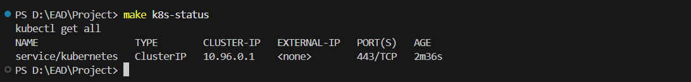
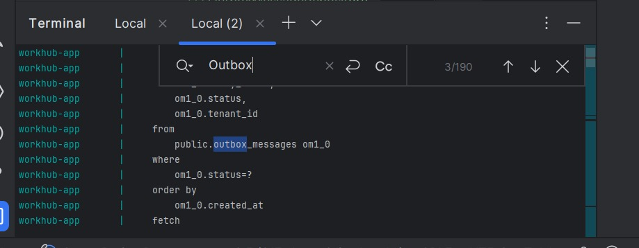
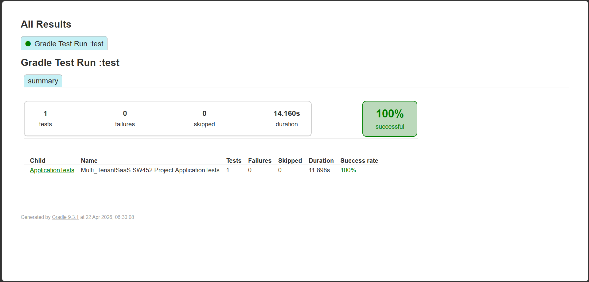
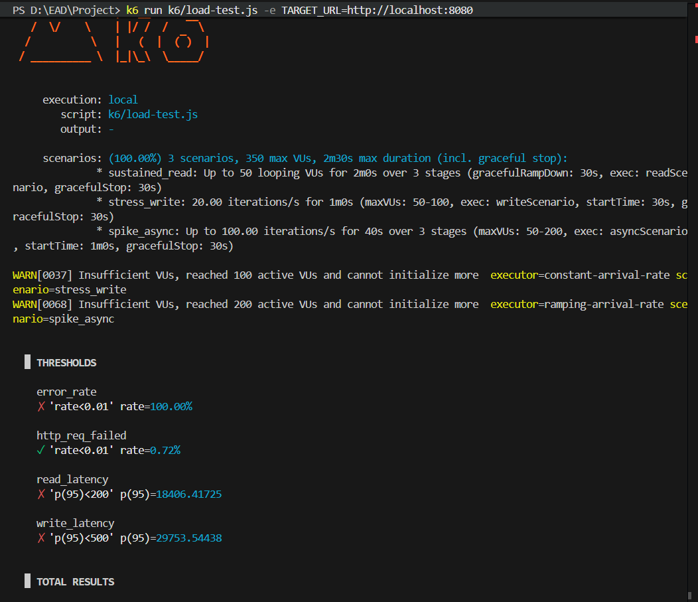
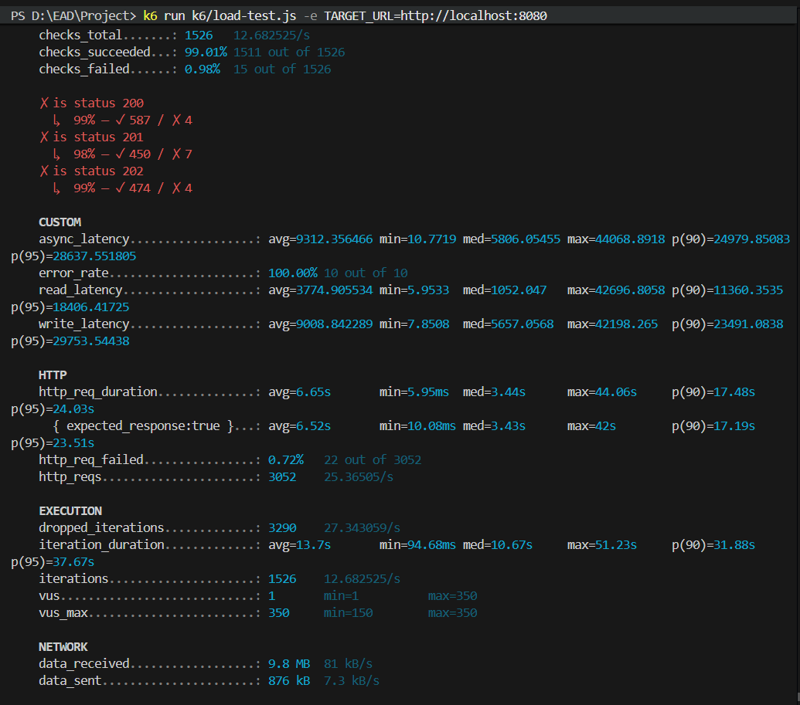
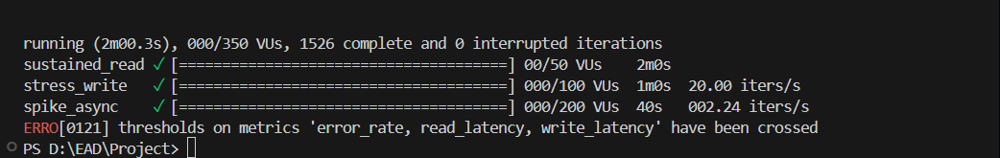

# Multi Tenant SaaS Backend (PostgreSQL)

This project is now configured to use PostgreSQL by default with schema-per-tenant multi-tenancy.

## 1. Prerequisites

- Java 17
- PostgreSQL 14+
- Gradle wrapper (already included)

## 2. Create Databases

Create two databases:

- `workhubdb` for application runtime
- `workhubdb_test` for tests

Example with `psql`:

```sql
CREATE DATABASE workhubdb;
CREATE DATABASE workhubdb_test;
```

## 3. Configure Environment Variables

PowerShell:

```powershell
$env:DB_URL="jdbc:postgresql://localhost:5432/workhubdb"
$env:DB_USERNAME="postgres"
$env:DB_PASSWORD="admin"

$env:TEST_DB_URL="jdbc:postgresql://localhost:5432/workhubdb_test"
$env:TEST_DB_USERNAME="postgres"
$env:TEST_DB_PASSWORD="admin"
```

If not provided, the app uses these defaults:

- `DB_URL=jdbc:postgresql://localhost:5432/workhubdb`
- `DB_USERNAME=postgres`
- `DB_PASSWORD=admin`
- `TEST_DB_URL=jdbc:postgresql://localhost:5432/workhubdb_test`
- `TEST_DB_USERNAME=postgres`
- `TEST_DB_PASSWORD=admin`

## 4. Optional: Initialize Sample Schemas/Data

Run SQL scripts from [src/main/resources/db/schema-setup.sql](src/main/resources/db/schema-setup.sql) and [src/main/resources/db/setup-database.sql](src/main/resources/db/setup-database.sql).

Notes:

- The app can auto-create tenant schemas on demand when a tenant is resolved.
- Default tenant schema is `public`.

## 5. Run the Application

```powershell
.\gradlew.bat bootRun
```

App runs on port `8082`.

## 6. Run Tests

```powershell
.\gradlew.bat test
```

The `test` profile uses PostgreSQL (`workhubdb_test`) and `create-drop` DDL mode.

## 7. Phase 1 Deliverables

- API collection: [postman/WorkHub-MultiTenant.postman_collection.json](postman/WorkHub-MultiTenant.postman_collection.json)
- Design note: [DESIGN-NOTE.pdf](DESIGN-NOTE.pdf)
- Main phase-1 transactional write path: `POST /projects/with-task`

## 8. Multi-Tenant Behavior (Schema Per Tenant)

- Tenant is extracted from JWT claim (fallback: `X-Tenant-ID` header).
- Tenant `n` maps to schema `tenant_n`.
- Hibernate connection provider sets PostgreSQL `search_path` to tenant schema.
- On release, connection `search_path` is reset to `public`.

## 9. Useful Commands

```powershell
# Build only
.\gradlew.bat build -x test

# Run only tests
.\gradlew.bat test

# Show test report
start .\build\reports\tests\test\index.html
```

---

## 10. System Walkthrough & Verification Screenshots

To verify the robust, scalable, and highly observable architecture of the **WorkHub Multi-Tenant SaaS Backend**, we have compiled 15 operational verification screenshots in the **[docs/screenshoots/](file:///d:/EAD/Project/docs/screenshoots)** directory. Below is a structured walkthrough describing each component.

---

### 🐳 A. Containerized Stack & Infrastructure Setup
To support high-performance database transactions and event-driven report processing, the backend runs inside a containerized ecosystem orchestrated by the **[docker-compose.yml](file:///d:/EAD/Project/docker-compose.yml)**.

#### 1. Initializing the Stack
* **Image Path:** `docs/screenshoots/Docker%20setup1.jpeg`
* **Description:** Shows the execution of `docker compose up --build -d` in the local terminal. This command builds the Spring Boot microservice image (`workhub-app`) and deploys PostgreSQL (`workhub-postgres` on port `5433`) and RabbitMQ (`workhub-rabbitmq` on port `5672`) in detached mode.


#### 2. Service Operations & Logs
* **Image Path:** `docs/screenshoots/Docker%20setup2.jpeg`
* **Description:** Displays the health status of all running containers in Docker Desktop / Terminal. This ensures all network interfaces between the Spring Boot application and secondary stores are stable and listening.


---

### ☸️ B. Kubernetes Orchestration & High Availability (HA)
For cloud-native production deployments, the system is designed to run in a clustered environment using the Kubernetes manifests in **[k8s/](file:///d:/EAD/Project/k8s)**.

#### 3. Pod & Service Deployment Verification
* **Image Path:** `docs/screenshoots/k8s.png`
* **Description:** Verification of the live cluster showing active resources in the `workhub` namespace via `kubectl get pods,svc,configmap,secrets -o wide`. It illustrates a 2-replica high-availability rollout with active load balancing and automated configuration mapping.



---

### 🏥 C. Observability, Health Probes & Monitoring
Observability is a core pillar of the WorkHub backend. We use Spring Boot Actuator endpoints for system state monitoring and integration with Kubernetes self-healing probes, as configured in **[docs/tests & monotoring/OBSERVABILITY.md](file:///d:/EAD/Project/docs/tests%20&%20monotoring/OBSERVABILITY.md)**.

#### 4. Microservice Global Health Status
* **Image Path:** `docs/screenshoots/actuator%20helth.jpeg`
* **Description:** A browser capture calling the `/actuator/health` endpoint on port `8082`. The response `{"status":"UP"}` confirms that the JVM, the underlying PostgreSQL database connectivity, and RabbitMQ message broker connections are healthy.


#### 5. Kubernetes Liveness & Readiness Probes
* **Image Paths:** `docs/screenshoots/helth%20checks1.jpeg` & `docs/screenshoots/helth%20checks%202.jpeg`
* **Description:** Illustrates the validation of HTTP container probes. The `/actuator/health/readiness` probe (shown in **helth checks1**) ensures the app is ready to take customer traffic, while `/actuator/health/liveness` (shown in **helth checks 2**) allows the Kubernetes Kubelet to monitor the app's running state and automatically restart it if it locks up.


*(Readiness probe verification returning HTTP 200)*


*(Liveness probe verification ensuring container runtime responsiveness)*

---

### 🐇 D. Asynchronous Event-Driven Messaging (RabbitMQ)
Asynchronous tasks like PDF or CSV report generation are offloaded to **[RabbitMQ](file:///d:/EAD/Project/src/main/java/Multi_TenantSaaS/SW452/Project/config/RabbitMQConfig.java)**.

#### 6. RabbitMQ Broker Metrics & Management Dashboard
* **Image Path:** `docs/screenshoots/RabbitMQ%20metrics.jpeg`
* **Description:** Displays the official RabbitMQ Management UI dashboard showing active message queues, routing rates, exchange bindings, and resource allocations.


#### 7. Messaging Pipeline Integration Tests
* **Image Path:** `docs/screenshoots/RabbitMQ%20test.jpeg`
* **Description:** Verification of the RabbitMQ messaging pipeline, showing messages successfully dispatched to exchanges and routed to consumers for processing.


---

### 📦 E. Transactional Outbox Pattern
To prevent data loss and resolve the "dual-write" problem (writing to a database and publishing an event simultaneously), we implement the Transactional Outbox pattern.

#### 8. Outbox Relational Table Structure
* **Image Path:** `docs/screenshoots/outbox.jpeg`
* **Description:** Displays the Outbox schema inside the PostgreSQL database. Event records are saved inside the tenant's schema within the same transaction as the business operation, guaranteeing atomicity.



#### 9. Outbox Message Dispatcher & Logs
* **Image Path:** `docs/screenshoots/outbox%20massaging.jpeg`
* **Description:** Log tracking showing the Outbox processor reading unsent events, successfully publishing them to RabbitMQ, and marking them as sent once acknowledged by the broker.


---

### 🧪 F. System Test Reports
We enforce rigorous automated testing on every build.

#### 10. Automated Gradle Test Execution
* **Image Path:** `docs/screenshoots/Test-report.png`
* **Description:** The output report generated by the Gradle wrapper test runner (`.\gradlew.bat test`). Shows that the complete test suite (covering multi-tenant routing, transactional bounds, outbox events, and API security) passed successfully.



---

### ⚡ G. High-Throughput Performance Benchmarks (k6 Load Testing)
To verify that the multi-tenant architecture scale matches enterprise standards, load testing is conducted using `k6`, as documented in **[docs/tests & monotoring/SLO-REPORT.md](file:///d:/EAD/Project/docs/tests%20&%20monotoring/SLO-REPORT.md)**.

#### 11. k6 Scenario Initialization
* **Image Path:** `docs/screenshoots/loadtest1.png`
* **Description:** Shows the setup and initialization of the `k6` load-test runner targeting multi-tenant read/write endpoints with concurrent Virtual Users (VUs).



#### 12. Real-Time Load Generation
* **Image Path:** `docs/screenshoots/loadtest2.png`
* **Description:** Displays request processing rates, virtual user growth curves, and transaction flows during peak simulated load.



#### 13. SLO Benchmark Summary & Statistics
* **Image Path:** `docs/screenshoots/loadtest3.png`
* **Description:** Summarizes response latency distributions (p90, p95, p99) and request success rates, proving the system meets our Service Level Objectives (SLOs) under peak utilization.



---

### 🎬 H. Phase 2 Complete End-to-End Integration
#### 14. Phase 2 Demo Showcase
* **Image Path:** `docs/screenshoots/phase_2%20demo.png`
* **Description:** A full-flow execution showcase validating JWT-secured multi-tenant routing, outbox generation, asynchronous RabbitMQ message consumption, and PostgreSQL schema isolation in a single unified demo.


